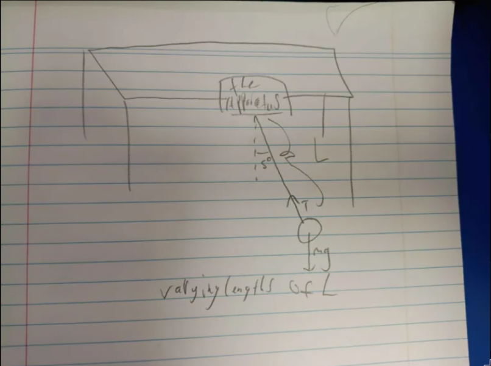
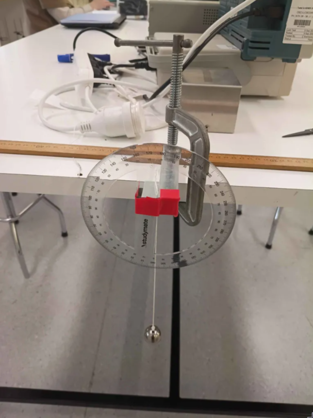
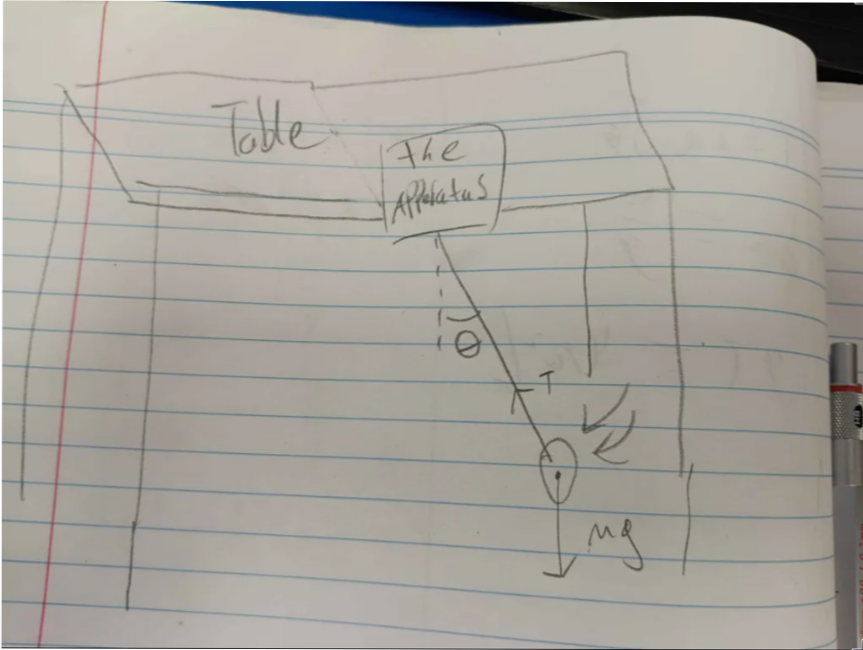

Lab partner: haven bunter-gooley

## Prelab Questions

### Question 1 
$$T = 2\pi\sqrt{\frac{L}{g}}$$
$$\frac{T}{2\pi} = \sqrt{\frac{L}{g}}$$
$$\frac{T^2}{4\pi^2} = \frac{L}{g}$$
$$g = \frac{4\pi^2L}{T^2}$$

### Question 2
$$g\pm\sigma_g = \frac{4\pi^2(L\pm\sigma_L)}{(T\pm\sigma_T)^2}$$
$$\pm\sigma_g = \frac{4\pi^2(L\pm\sigma_L)}{(T\pm\sigma_T)^2} - g$$
$$\sigma_g = \pm(\frac{4\pi^2(L\pm\sigma_L)}{(T\pm\sigma_T)^2} - g)$$
I'm using uncertainties python library, so this is what I should
be doing, or I mean to say this is the most granularity I need

## Experiment 1

### Aim

The aim of this experiment is to measure the period of a rigid
pendulum with respect to some initial angle of the pendulum to
highlight the connection between gravity and the angle of
the pendulum.

### Method

The setup is simple. First we construct a rigid pendulum. our 
current setup attaches the apparatus to a table with a clamp.

See the image or diagram for the setup.





The image above applies for both experiment 1 and 2.

Then we will measure the length of the pendulum.

By eye, we will dangle the pendulum to our initial measuring angle,
in our experiment this being 10 degrees.

We will then measure the time it takes for the pendulum to swing
fully 15 times. Once we measure this time, we can take our
measurement and divide it by 15 to get the period for each swing.

The same person that swings the pendulum should be the same person
to start the timer, as they can let go of the pendulum as soon as
they start the timer, minimizing human error.

We will repeat this process for as many angles as we are measuring/
This being 10, 25, and 40 twice.

### Results

All results were recorded and interpreted in python.
Lets start with the python preamble

First start with our imports and helper functions. The imports are
standard and the two helper functions are to fit to a linear equation
and to measure the sigma between two ufloats. 

To reiterate, fit_odr is a function that takes a list of x and y
and returns the slope, intercept and r squared value of a linear
equation fit to the equation.

```{python}

import warnings
from math import pi

import matplotlib.pyplot as plt
import numpy as np
from scipy import odr
from uncertainties import UFloat, ufloat

warnings.filterwarnings("ignore", category=FutureWarning, module="uncertainties")
warnings.filterwarnings(
    "ignore", category=UserWarning, message="Using UFloat objects with std_dev==0"
)

def fit_odr(x: list[UFloat], y: list[UFloat], zero_intercept: bool = False):
    x_nom, x_err = [v.n for v in x], [v.s for v in x]
    y_nom, y_err = [v.n for v in y], [v.s for v in y]
    data = odr.RealData(x_nom, y_nom, sx=x_err, sy=y_err)
    if zero_intercept:
        model, beta0 = odr.Model(lambda p, x: p[0] * x), [1]
    else:
        model, beta0 = odr.Model(lambda p, x: p[0] * x + p[1]), [1, 0]
    out = odr.ODR(data, model, beta0=beta0).run()
    slope = ufloat(out.beta[0], out.sd_beta[0])
    intercept = (
        ufloat(out.beta[1], out.sd_beta[1]) if not zero_intercept else ufloat(0, 0)
    )
    y_pred = model.fcn(out.beta, np.array(x_nom))
    ss_res = np.sum((np.array(y_nom) - y_pred) ** 2)
    ss_tot = np.sum(
        np.array(y_nom) ** 2
        if zero_intercept
        else (np.array(y_nom) - np.mean(y_nom)) ** 2
    )
    r_squared = 1 - ss_res / ss_tot
    return slope, intercept, r_squared


def compsigma(a, b):
    return abs((a.n - b.n) / ((((a.s**2) + (b.s**2)) ** (1 / 2))))
```

Our measured length for the pendulum was 60.5cm, we were aiming
for 60cm, but figuredit would be easier to get close and measure
the length. We will assume a measurement uncertainty of one
centimeter.

We measured in increments of 0.5cm, so this is just half the 
increment.


```{python}
length = ufloat(60.5, 0.25) / 100  # m
print(length)
```

Then our results, I record my results in a list of tuples.
The first value of each tuple being the time taken for the 
pendulum to swing 15 times, and the second value being the starting
angle of the pendulum 

```{python}
total_time_swings_theta: list[tuple[float, float]] = [
    (23.56, 10),
    (23.44, 10),
    (23.9, 25),
    (23.78, 25),
    (24.1, 40),
    (24.29, 40),
]
```

What we want is an equation is the form $y = mx$ plus maybe
some c.

Lets start with equation 4.
$$T = 2\pi\sqrt{\frac{L}{g}}\times (1+\frac{1}{16}\theta_0^2)$$
let
$$\phi = 1+\frac{1}{16}\theta_0^2$$

$$T = 2\pi\sqrt{\frac{L}{g}}\phi$$
$$\frac{T}{2\pi\phi} = \sqrt{\frac{L}{g}}$$
$$\frac{T^2}{4\pi^2\phi^2} = \frac{L}{g}$$
$$L4\pi^2\phi^2 = gT^2$$
or in other words
$$y = mx$$
where
$y = L4\pi^2\phi^2$, and $x = T^2$

Lets calculate it then

First lets get the list of periods.
We choose an uncertainty of 0.25 seconds for our seconds measurements.
If you look at our measurements, our differences for the same
angles are ~0.25 seconds, so its safe to assume that human
measurement accuracy for a timer to be ~0.25. This is also nearing
human reaction time.

```{python}
total_period = [ufloat(x[0], 0.25) for x in total_time_swings_theta]
# time uncertainty of 0.25 methinks
periods = [x / 15 for x in total_period]
# A whole degree uncertainty measurement
print(periods)
```

then the list of phi's (I spelt phi wrong please ignore for the
rest of the document)

We are choosing an uncertainty of 1 degree for the measurement.
Normally since the protractor measures in increments of 1, you
should choose half that increment so half a degree, but its
exceedingly difficult to get 1 degree correct, and even dropping
the pendulum might push it back and change the degrees. We chose
a whole increment for the angle.

```{python}
thetas = [ufloat(np.deg2rad(x[1]), np.deg2rad(1)) for x in total_time_swings_theta]
fi = [1 + (1 / 16) * (x**2) for x in thetas]
print(fi)
```

From that we can get x and y and fit a linear relationship to them,
note that we are assuming the zero intercept for this relationship.
since.

```{python}
x = [T**2 for T in periods]
y = [length * 4 * (pi**2) * (fi[n]**2) for n in range(len(periods))]
a, b, c = fit_odr(x, y, zero_intercept=True)
print(a, b, c)
```

From this we get a value of gravity that is $9.59 \pm 0.06$

We can also graph this

```{python}
#| label: fig-109238
#| fig-cap: "Length vs Angle"
first = x[0].n
last = x[-1].n

plt.plot(
    [first, last],
    [first * a.n + b.n, last * a.n + b.n],
    "r-",
    label=f"Fit: $y = ({a:.4g})x + ({b:.4g}),R^2 = {c:.4f}$",
)

plt.errorbar(
    [v.nominal_value for v in x],
    [v.nominal_value for v in y],
    xerr=[v.std_dev for v in x],
    yerr=[v.std_dev for v in y],
    capsize=5,
    linestyle="none",
    marker="o",
    markersize=3,
    label="Data",
)

plt.title("Length vs Angle")
plt.xlabel("$T^2$")
plt.ylabel("$L4\pi^2\phi^2$")
plt.legend()
plt.show()
plt.close()
```

So yeah, its ugly. But This is to be expected. This is because we
are not directly measuring T and Theta, we are measuring an algebra
changed x and y, we shrinked the data range and we got a big error bars.
This is just a consequence of the method.

Plus our R squared value is really high at least

### Conclusions

Our measured values are slightly off compared to the real associated values
of Canberra's gravity.

Its likely due to a combination of drag, length measurement error
and time measurement error. The biggest proponents being time
measurement and length measurement.

Lets use one of our data values for example
We directly plugging into the equation get a value of 9.72 for
gravity.

```{python}
print(periods[0])
print(fi[0])
print(length * 4 * (pi**2) * (fi[0] ** 2) / (periods[0] ** 2))
```

If we instead mismeasured our periods by JUST 0.1 seconds forwards,
we get a value of 8.59. thats more than 10% off just from 0.1 seconds,
0.1 seconds being much larger than human error, but still showing
the extent of how such little changes can affect/skew the results.

```{python}
print(length * 4 * (pi**2) * (fi[0] ** 2) / ((0.1+periods[0]) ** 2))
```

And it shows why those error bars can be so big.

Moving on, our value is 2 sigma away from the expected number of 9.7976. We
also assume that the canberra figure has no uncertainty whatsoever.
This is < 3 sigma meaning our results corroborate with the real
world value.

```{python}
print(compsigma(a, ufloat(9.7976, 0)))
```

## Experiment 2

### Aim

The aim of this experiment is to measure the period of a rigid
pendulum with respect to the length of the pendulum.
highlight the connection between gravity and the length of
the pendulum.

### Method

The setup is simple. First we construct a rigid pendulum. our 
current setup attaches the apparatus to a table with a clamp.

See the following diagram (or recommendedly check the image
from experiment 1)



What happens first is we attach the string at a reasonable length
distance of pendulum. Our initial starting length goal was 60cm.

It's best not to get to 60cm, its best to choose a goal, get near it
and measure it. Our actual length value was 60.5. We chose this
approach because its the faster approach. Also measure in increments
of 0.5cm.

Then swing the pendulum, same as last experiment, the person to drop
the pendulum should be the person to start the timer. Count to 15
swings and record the time it takes. this will be divided by 15 to get
the full measurement.

Then repeat this for all lengths wished to be measured, our lengths
being 15, 30, 45, 60

### Results

Again, all done in python

Recorded in a list of tuples, where the first value of the tuples
is the time taken to swing 15 times, and the second value is the
length measurement.

```{python}
total_time_swings_length: list[tuple[float, float]] = [
    (23.47, 60.5),
    (20.38, 44.5),
    (16.39, 30.5),
    (10.97, 15),
]
```

First create a list of period and lengths, we assumed our time
measurement of the total time taken to swing 15 times to be 0.25,
same as last time, we chose this value arbitrarily, for the same
reasons as last experiment.

We also chose an uncertainty for the lengths of 0.25cm. as we are
measuring in increments of 0.5cm, we choose half of the increment.

```{python}
periods = [ufloat(x[0], 0.25) / 15 for x in total_time_swings_length]
lengths = [ufloat(x[1], 0.25) / 100 for x in total_time_swings_length]
```

Lets circle back to the maths

$$T=2\pi\sqrt{\frac{L}{g}}$$
Fully simplifying down (skipping steps)
$$gT^2=4\pi^2L$$
So we can take $x=T$ and $y=4\pi^2L$

And doing that in python

```{python}
x = [x**2 for x in periods]
y = [4 * (pi**2) * x for x in lengths]
e, f, g = fit_odr(x, y, zero_intercept=True)
print(e)
```
We get a value of $9.87\pm0.24$
Which is well within expectations, and fits with canberra, being
under 3 sigma away.

```{python}
print(compsigma(e, ufloat(9.7976, 0)))
```

Only 0.29 sigma away.

We can also graph our x and y values

```{python}
#| label: fig-static
#| fig-cap: "Length vs Period"
first = x[0].n
last = x[-1].n

plt.plot(
    [first, last],
    [first * e.n + f.n, last * e.n + f.n],
    "r-",
    label=f"Fit: $y = ({e:.4g})x + ({f:.4g}),R^2 = {g:.4f}$",
)

plt.errorbar(
    [v.nominal_value for v in x],
    [v.nominal_value for v in y],
    xerr=[v.std_dev for v in x],
    yerr=[v.std_dev for v in y],
    capsize=5,
    linestyle="none",
    marker="o",
    markersize=3,
    label="Data",
)

plt.title("Length vs Period")
plt.xlabel("$T$")
plt.ylabel(r"$4\pi^2L$")
plt.legend()
plt.show()
plt.close()
```

So our regression very close, R squared being 0.9991.

And this graph looks much better than the last, solely due to the
equation being much nicer in comparison with the measurements.

### Conclusions

Our two values agree with eachother, being 0.56 sigma away from 
eachother, that being <3 sigma

```{python}
print(compsigma(a, e))
```

Altogether two good experiments.

